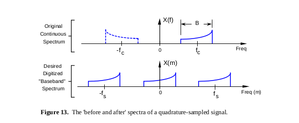

# I/Q sampling

We have bandpass signal centered at frequency *f*, we want it centered at *0 Hz*. Benefits:
  - lower sampling rate required
  - complex signal is obtained - makes operations easier (and must be complex because new spectrum is not necessarily symmetrical)
  
  
  
  
  ---
  
  Sources:
   1. *Quadrature signals: Complex, but not complicated* - R. Lyons