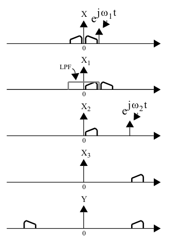
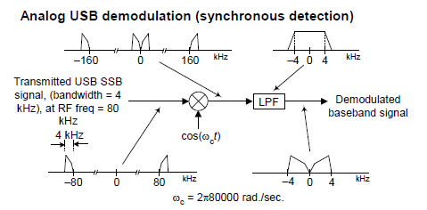

# Analog
### Amplitude modulation (AM)
**In time domain**

We have carrier wave
 $$c(t) = Acos(2\pi f_c t)$$
and message *m(t)*. 

AM signal is 
$$s(t) = (1 + \frac{m(t)}{A}) c(t)$$

**In frequency domain**

We have sum of *c(t)* (so we have a peak at carrier frequency) and

$$\frac{m(t)}{A} c(t) = \frac{m(t)}{A} \frac{A}{2} (e^{j 2 \pi f_c t} + e^{- j 2 \pi f_c t}) $$

so, due to frequency shift property of Fourier transform

$$F \{ s(t) * e^{j 2 \pi f_0 t}\} (f) = F \{ s(t) \} (f - f_0)$$

we also have the message signal's spectrum shifted to be around the carrier frequency. Of course (signal is real, we have two complex exponentials for shifting up and down) spectrum is (conjugate) symmetrical, as below.

**Modulation**

1. Digital - just multiply signals and use ADC to linear amplifier.
2. Analog - ?

**Demodulation**

1. Analog - diode envelope detector...

2. Digital (from I/Q samples):

$$I(t) = LPF(s(t) * cos(2\pi f_c t + \phi_0)) = LPF(\frac{1}{2} (1 + \frac{m(t)}{A}) (Acos(4\pi f_c t + \phi_0) + Acos(\phi_0)) = \frac{1}{2}cos(\phi_0) (A + m(t))$$

and

$$Q(t) = LPF(s(t) * sin(2\pi f_c t + \phi_0)) = LPF(\frac{1}{2} (1 + \frac{m(t)}{A}) (Asin(4\pi f_c t + \phi_0) - Asin(\phi_0)) = \frac{1}{2}sin(\phi_0) (A + m(t))$$

So 

$$\sqrt{I^2(t) + Q^2(t)} = \frac{\sqrt{2}}{2} (A + m(t)) $$

and after applying high-pass filter we obtain scaled source signal.

### Double sideband suppressed carrier (DSB-SC) modulation

**In time domain**

We have carrier wave
 $$c(t) = Acos(2\pi f_c t)$$
and message *m(t)*. 

DSB-SC signal is 
$$s(t) = m(t) c(t)$$

**In frequency domain**

We have the same signal as in AM but without carrier *c(t)*. Hence spectrum is **the same as for AM** but without peak at carrier frequency.

**Modulation**

By mixing carrier and message - in DSP or in analog (according to Wikipedia).

**Demodulation**

**Same as for AM** except final high-pass filter (to remove additional DC component) is not necessary.

### Single sideband (SSB) modulation - upper (USB), lower (LSB)

**In time domain**

We have carrier wave
 $$c(t) = Acos(2\pi f_c t)$$
and message *m(t)*. 

USB signal is 
$$s_{usb}(t) = A ( m(t) cos(2\pi f_c t) - \hat{m}(t) sin(2\pi f_c t) )$$

and LSB signal is

$$s_{lsb}(t) = A ( m(t) cos(2\pi f_c t) + \hat{m}(t) sin(2\pi f_c t) )$$

where $$ \hat{m}(t) $$ is **Hilbert transform** of original signal *m(t)*. It's a signal such that **analytic representation** of *m(t)*

$$m_a(t) = m(t) + j \hat{m}(t)$$ 

has spectrum 

$$
S_a(f) =
\begin{cases}
2 S(f), \ f > 0 \\
S(f), \ f = 0 \\
0, \ f < 0
\end{cases}
$$

i.e. it only keeps upper half of conjugate symmetrical spectrum of *m(t)*.

**In frequency domain**

Notice that e.g. for USB signal

$$s_{usb}(t) = A ( m(t) cos(2\pi f_c t) - \hat{m}(t) sin(2\pi f_c t) ) = Re \{ m_a (t) * e^{j 2 \pi f_c t} \}$$

and signal $$ m_a (t) * e^{j 2 \pi f_c t} $$ has spectrum of only positive frequency components of *m(t)* shifted up by carrier frequency. Therefore it's another analytic signal and taking real part gives a symmetrical spectrum with only 1 sideband above the carrier.

For LSB signal

$$s_{lsb}(t) = A ( m(t) cos(2\pi f_c t) + \hat{m}(t) sin(2\pi f_c t) ) = Re \{ (m(t) - j \hat{m}(t) ) * e^{j 2 \pi f_c t} \}$$

and signal $$ m(t) - j \hat{m}(t) $$

has only negative frequency components of *m(t)*, so after shifting up it has only 1 sideband but below the carrier.

Example spectrum of LSB signal (with steps of Weaver modulation process).

**Modulation**

**Demodulation**

1. **Synchronous detection method** - i.e. given I/Q samples - just take in-phase samples!

Derivation for LSB:

$$
I(t) = LPF(s_{lsb}(t) * cos(2\pi f_c t + \phi_0)) = A * LPF( ( m(t) cos(2\pi f_c t) + \hat{m}(t) sin(2\pi f_c t) ) * cos(2\pi f_c t + \phi_0) ) = \\  = \frac{A}{2} * LPF ( m(t) * ( cos(4\pi f_c t + \phi_0) + cos(\phi_0) ) + \hat{m}(t) * ( sin(\phi_0)  - sin(4\pi f_c t + \phi_0) ) ) = \\ = \frac{A}{2} * ( m(t) * cos (\phi_0) + \hat{m}(t) * sin(\phi_0) )
$$

So if frequency is aligned we get combination of *m(t)* and it's Hilbert transform, which is acceptable for speech communication. If phase is also aligned we get demodulation from above image.

This method requires that there is signal on 1 sideband only - if there is an unrelated one on the other sideband, they will add together.

2. **Phasing method**

**TODO**

This method allows extraction of lower and upper sideband separately and allows both being present.

### Frequency modulation (FM)

# Digital
### Quadrature amplitude modulation (QAM)

### Amplitude shift keying (ASK)

### Phase shift keying (PSK)

### Frequency shift keying (FSK)

---

Sources:
 1. [Amplitude modulation - Wikipedia](https://en.wikipedia.org/wiki/Amplitude_modulation#Analysis) - formula and spectrum
 2. *Telecommunication breakdown* 2.3 - AM spectrum from Fourier transform frequency shift property
 3. [SSB demodulation methods](https://www.dsprelated.com/showarticle/176.php)
 4. [Complex signals - examples on SSB modulation & demodulation](https://www.mikrocontroller.net/attachment/151612/complex_signals.pdf)